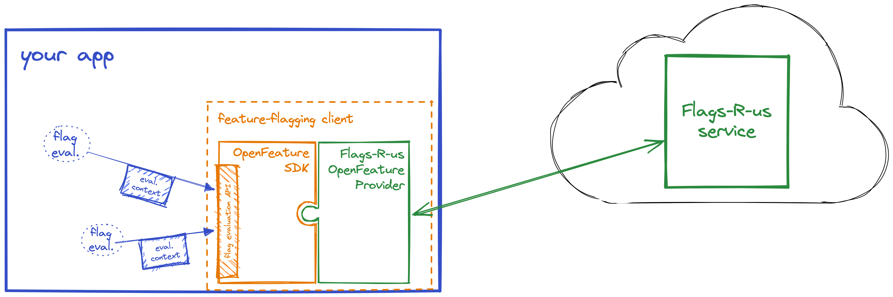
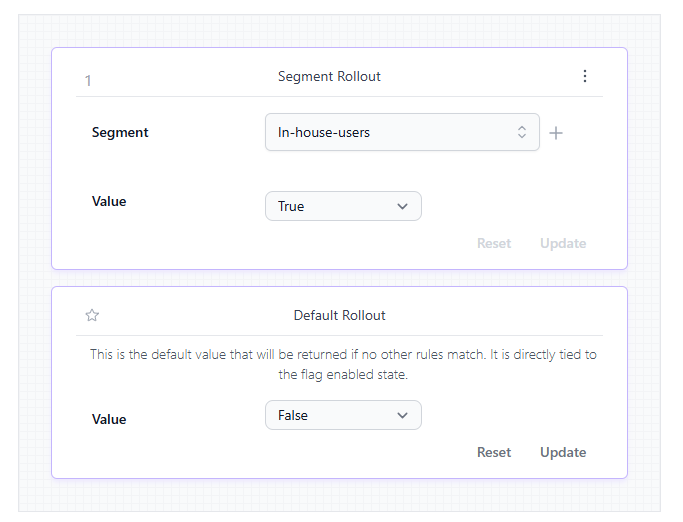

# Fun With Flags

---

What problem are we trying to solve?

---

# Trunk Based Development

* Continuous Integration
* Continuous Delivery (if not deployment)

---

* Automated Tests (high confidence)
* No long lived feature branches
* Push _at least_ daily...

---

# Challenges

* Don't break production
* No breaking changes

---

# Feature Flags

---

# Simplest possible thing that works

```json
{
    "FeatureManagement": {
        "ShinyNewFeature": true
    }
}
```

<!--
What's the simplest thing that will work? How about just configuration? Totally standard ,NET appsettings...
-->

---

# In code

```csharp
Console.WriteLine("Hello, World!");

if (configuration["FeatureManagement:ShinyNewFeature"] == "true")
{
    Console.WriteLine($"The time now is: {DateTime.Now}");
}
```

<!--
That works... but please don't do that... I've tidied that up a teeny bit in demo 2 - so lets just take a look at that
-->

---

# Demo 02

---

# Learning...

1. It doesn't have to be complicated
1. It should still be good code

---

# Keeping code clean

- Demo 03

---

# Branch by Abstraction

* Demo 04

---

# Nicer Branch by Abstraction

* Demo 05

---

# Learning...

* Lifetime is important

---

# A small detour

Changing storage 

---

# Step 1

* Read from old
* Write to both
* Validate new (read from both and compare)

---

# Step 2

* Read from new
    * Fall back to old
* Write to Both

---

# Step 3

* Read from new
    * Fall back to old
* Write to new
* Backfill new

---

# Step 4

* Read from new
* Write to new
* decommission old

---

# Beyond Configuration

* Launch Darkly?

<!-- 
Whilst its possible to a long way just with configuration, there will come a point where you hit limits - you'll want to be able to change flags without deploying or used more advanced capabilities like targetting or progressive rollouts 
-->

---

# Microsoft Feature Management

* Configuration Based
* Azure App Configuration
* SDKs for multiple languages

---

# Demo06

---

# Vendor Lock In

---


---

# Standardised API



---

# Demo 08 (7 didn't work!)

* Flagd
* Flipt

<!--
I wanted to show using Microsoft Feature Management, but that doesn't quite work as I expected, so we'll go with two different open source solutions.
-->

---

# Flagd - https://flagd.dev/

flagd is a feature flag evaluation engine. Think of it as a ready-made, open source, OpenFeature-compliant feature flag backend system.

---

## Flag configuration

```js
{
  "$schema": "https://flagd.dev/schema/v0/flags.json",
  "flags": {
    "new-welcome-banner": {
      "state": "ENABLED",
      "variants": {
        "on": true,
        "off": false
      },
      "defaultVariant": "off",
      "targeting": { 
        "if": [
          { "ends_with": [{ "var": "email" }, "@example.com"] },
          "on",
          "off"
        ]
      }
    }
  }
}
```

---


# Flipt - https://github.com/flipt-io/flipt

An enterprise-ready, GRPC powered, GitOps enabled, CloudNative, feature management solution

---

# UI!



<!-- 
It has a UI...
-->

<!--

A bit meta, we're going to change the source of the flags with a flag...
-->
---

# Demo 11 (ooops...)

* Flags are not real time

---

# Thoughts

* OpenFeature is not quite there yet

---

# HERE BE DRAGONS

## Clients and Servers

* A client that's a client needs a client SDK
* A client that's a server needs a server SDK

To talk to something

* That is a server serves flags

They may well behave differently and will make different assumptions

---

# HERE BE DRAGONS

## Microservices

* Don't attempt to coordinate across services
* Or attempt to coordinate flags between client (UI) and server
    * Possibly signal by other means
* DO use versioning of APIs / Messages / etc


---

# Tell 'em what you told 'em

* It doesn't have to be complicated
* Start simple
* Naming matters
* Clean up as early as possible

---

# More

* There are lots of options for services
    * Self hosted
    * SaaS
* Pay attention to you needs
    * Language SDKs / providers
    * functionaltiy
    * UX
* Local dev doesn't have to use the same things

--- 

# More...

* OpenFeature - capability is there
* OpenFeature - implementations catching up
* async / await 🤦

---

# Combinatorial Explosion


---

# Pipeline

* The aim is to have code that doesn't break production
* You gate by testing with the production flags
* If the code passes _with production flags_ its good to go...
* QA etc is done with different flags

---

# Links

* Feature Toggles (aka Feature Flags)
  https://martinfowler.com/articles/feature-toggles.html
* Branch By Abstraction
  https://martinfowler.com/bliki/BranchByAbstraction.html
* OpenFeature
  https://openfeature.dev/
* Me
    * Bluesky - https://bsky.app/profile/murph.recumbent.co.uk
    * Github - https://github.com/recumbent


